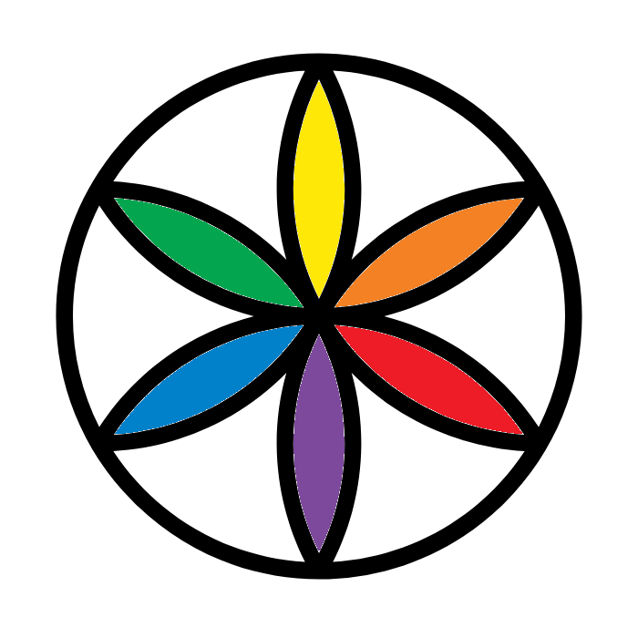

# Exact 432Hz Player (Android APP)

### Google Play Closed Testing
I need more people (12people+14days) to test the app to publish public version on internet. (Google Play Rule) You can follow 3 step to join test program and install app in your
Android device.
1. Add Test Group: https://groups.google.com/g/exact-432hz-player-app-test-group
2. Become a tester: https://play.google.com/apps/testing/com.exact432hz.exact432hzplayer
3. Install App: https://play.google.com/store/apps/details?id=com.exact432hz.exact432hzplayer

### Introduction
Exact 432Hz Player analyzes the instrument frequencies from the first 10 seconds of the audio file (PCM raw data) and automatically adjusts the playback pitch to convert all music to a 432Hz tone.

This APP is based on Retro Music Player with GPL-3.0 license. Thanks for the developers/contributors of RetroMusicPlayer project.
https://github.com/RetroMusicPlayer/RetroMusicPlayer

